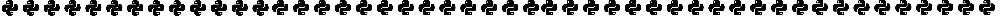

### Jupyter workshop

 Національний університет “Чернігівська політехніка”

# Використання онлайн інструментів на базі Python

 <i> В рамках програми підвищення кваліфікації </i> 

 <i> "ДИСТАНЦІЙНІ ЛАБОРАТОРІЇ ТА ІНСТРУМЕНТИ ДИСТАНЦІЙНОГО НАВЧАННЯ В ОСВІТІ" </i> 

<b> Пахалюк Богдан </b>

 Кафедра радіотехнічних та вбудованих систем

 2024 рік

#### Посилання для запуску

